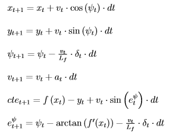

# Model Predictive Control (MPC) Project
**from Udacity's Self-Driving Car Engineer Nanodegree Program**

## Introduction
The aim of this project is to build an MPC which drives a vehicle in a simulator. A polynomial shall be fitted to the given waypoints. The cost function of the optimizer shall be tuned until the vehicle successfully completes at least one lap around the track. The MPC must be able to handle an additional latency of 100ms between actuation commands. The vehicle should drive as fast as possible but still savely.

## Rubric Points
### The Model
The state used in the MPC comprises the following variables:

- x-coordinate of the vehicle position [x]
- y-coordinate of the vehicle position [y]
- orientation of the vehicle / angle with respect to the x-axis [psi]
- speed of the vehicle [v]
- cross-track error [cte]
- orientation error [epsi]

All values are given with respect to the vehicle coordinate system and are based on meters, seconds and radiants, respectively.

The actuators are the steering angle [delta] in the range (-0.436, 0.436), i.e. (-25°, 25°), and throttle [a] (-1, 1) . The steering angle needs to be scaled to the range (-1, 1) before feeding it to the simulator. In the formulae of the MPC the actual angles have to be used.

For the estimation of the new state at timestep t+1 based on the state and actuators at time t I used the following formulae in the implementation:



For the optimization I started with the cost function we derived in the lessons and updated it step by step. First I applied weights for each portion of the cost in order to account for the different magnitudes of the variables used in the formulae. It also gives me the possibility to fine-tune the model later. I added the cost for the cross-track error of the last step twice. This prevents the predicted track from diverging from the reference trajectory and improves the results. As this is a race course, I applied also costs for velocity reduction over the course of the prediction horizon. This penalizes slowing down and rewards speeding up. The reference velocity I set to 50 m/s.

### Timestep Length and Elapsed Duration (N & dt)
I tried different combinations of timestep length and elapsed duration from N = 25 and dt = 0.05s to N = 10 and dt = 0.1s. The latter combination worked well when latency was turned off. However, after setting latency to 100ms I had to increase dt to 0.13s. Later I tweaked the hyperparameters of the MPC using the class `Twiddle`, which I programmed during the PID project. The best results I got with N = 9 and dt = 0.17s.  

### Polynomial Fitting and MPC Preprocessing
The simulator provides all coordinates with respect to the global coordinate system. Therefore, I transform the coordinates to the vehicle coordinate system before using them in the MPC. Note that whereas the coordinates are provided in meters according to the project description the velocity however is given in mph (see [this file](https://github.com/udacity/CarND-MPC-Project/blob/master/DATA.md)). Hence, I converted the speed to m/s.

At the beginning, I fitted a 2nd order polynomial to the waypoints until I found reasonable values for the weights of the cost function  as well as for N and dt. Afterwards, I changed to a 3rd order polynomial and fine-tuned the hyperparameters by means of `Twiddle`.

### Model Predictive Control with Latency
In order to account for latency in the MPC the state after 100ms must be predicted based on the current state of the vehicle received from the simulator. This new state is then used as initial state for the optimizer. For the estimation of the new state I used the same equations as for the MPC itself. I also had to adapt the hyperparameters of the MPC. On the one hand I increased dt to account for the extra time due to latency. On the other hand I had to increase the weights for cte and epsi in the cost function otherwise the vehicle would drive erratically. A timestep length of 0.13s and weights on the errors as high as 40 proved to be sound starting values for the hyperparameter tuning with `Twiddle`

---

The lines below are from the original README file of the [Udacity CarND-Controls-MPC project](https://github.com/udacity/CarND-MPC-Project)

## Dependencies

* cmake >= 3.5
 * All OSes: [click here for installation instructions](https://cmake.org/install/)
* make >= 4.1(mac, linux), 3.81(Windows)
  * Linux: make is installed by default on most Linux distros
  * Mac: [install Xcode command line tools to get make](https://developer.apple.com/xcode/features/)
  * Windows: [Click here for installation instructions](http://gnuwin32.sourceforge.net/packages/make.htm)
* gcc/g++ >= 5.4
  * Linux: gcc / g++ is installed by default on most Linux distros
  * Mac: same deal as make - [install Xcode command line tools]((https://developer.apple.com/xcode/features/)
  * Windows: recommend using [MinGW](http://www.mingw.org/)
* [uWebSockets](https://github.com/uWebSockets/uWebSockets)
  * Run either `install-mac.sh` or `install-ubuntu.sh`.
  * If you install from source, checkout to commit `e94b6e1`, i.e.
    ```
    git clone https://github.com/uWebSockets/uWebSockets
    cd uWebSockets
    git checkout e94b6e1
    ```
    Some function signatures have changed in v0.14.x. See [this PR](https://github.com/udacity/CarND-MPC-Project/pull/3) for more details.

* **Ipopt and CppAD:** Please refer to [this document](https://github.com/udacity/CarND-MPC-Project/blob/master/install_Ipopt_CppAD.md) for installation instructions.
* [Eigen](http://eigen.tuxfamily.org/index.php?title=Main_Page). This is already part of the repo so you shouldn't have to worry about it.
* Simulator. You can download these from the [releases tab](https://github.com/udacity/self-driving-car-sim/releases).
* Not a dependency but read the [DATA.md](./DATA.md) for a description of the data sent back from the simulator.


## Basic Build Instructions

1. Clone this repo.
2. Make a build directory: `mkdir build && cd build`
3. Compile: `cmake .. && make`
4. Run it: `./mpc`.

## Tips

1. It's recommended to test the MPC on basic examples to see if your implementation behaves as desired. One possible example
is the vehicle starting offset of a straight line (reference). If the MPC implementation is correct, after some number of timesteps
(not too many) it should find and track the reference line.
2. The `lake_track_waypoints.csv` file has the waypoints of the lake track. You could use this to fit polynomials and points and see of how well your model tracks curve. NOTE: This file might be not completely in sync with the simulator so your solution should NOT depend on it.
3. For visualization this C++ [matplotlib wrapper](https://github.com/lava/matplotlib-cpp) could be helpful.)
4.  Tips for setting up your environment are available [here](https://classroom.udacity.com/nanodegrees/nd013/parts/40f38239-66b6-46ec-ae68-03afd8a601c8/modules/0949fca6-b379-42af-a919-ee50aa304e6a/lessons/f758c44c-5e40-4e01-93b5-1a82aa4e044f/concepts/23d376c7-0195-4276-bdf0-e02f1f3c665d)
5. **VM Latency:** Some students have reported differences in behavior using VM's ostensibly a result of latency.  Please let us know if issues arise as a result of a VM environment.

## Editor Settings

We've purposefully kept editor configuration files out of this repo in order to
keep it as simple and environment agnostic as possible. However, we recommend
using the following settings:

* indent using spaces
* set tab width to 2 spaces (keeps the matrices in source code aligned)

## Code Style

Please (do your best to) stick to [Google's C++ style guide](https://google.github.io/styleguide/cppguide.html).

## Project Instructions and Rubric

Note: regardless of the changes you make, your project must be buildable using
cmake and make!

More information is only accessible by people who are already enrolled in Term 2
of CarND. If you are enrolled, see [the project page](https://classroom.udacity.com/nanodegrees/nd013/parts/40f38239-66b6-46ec-ae68-03afd8a601c8/modules/f1820894-8322-4bb3-81aa-b26b3c6dcbaf/lessons/b1ff3be0-c904-438e-aad3-2b5379f0e0c3/concepts/1a2255a0-e23c-44cf-8d41-39b8a3c8264a)
for instructions and the project rubric.

## Hints!

* You don't have to follow this directory structure, but if you do, your work
  will span all of the .cpp files here. Keep an eye out for TODOs.

## Call for IDE Profiles Pull Requests

Help your fellow students!

We decided to create Makefiles with cmake to keep this project as platform
agnostic as possible. Similarly, we omitted IDE profiles in order to we ensure
that students don't feel pressured to use one IDE or another.

However! I'd love to help people get up and running with their IDEs of choice.
If you've created a profile for an IDE that you think other students would
appreciate, we'd love to have you add the requisite profile files and
instructions to ide_profiles/. For example if you wanted to add a VS Code
profile, you'd add:

* /ide_profiles/vscode/.vscode
* /ide_profiles/vscode/README.md

The README should explain what the profile does, how to take advantage of it,
and how to install it.

Frankly, I've never been involved in a project with multiple IDE profiles
before. I believe the best way to handle this would be to keep them out of the
repo root to avoid clutter. My expectation is that most profiles will include
instructions to copy files to a new location to get picked up by the IDE, but
that's just a guess.

One last note here: regardless of the IDE used, every submitted project must
still be compilable with cmake and make./

## How to write a README
A well written README file can enhance your project and portfolio.  Develop your abilities to create professional README files by completing [this free course](https://www.udacity.com/course/writing-readmes--ud777).
